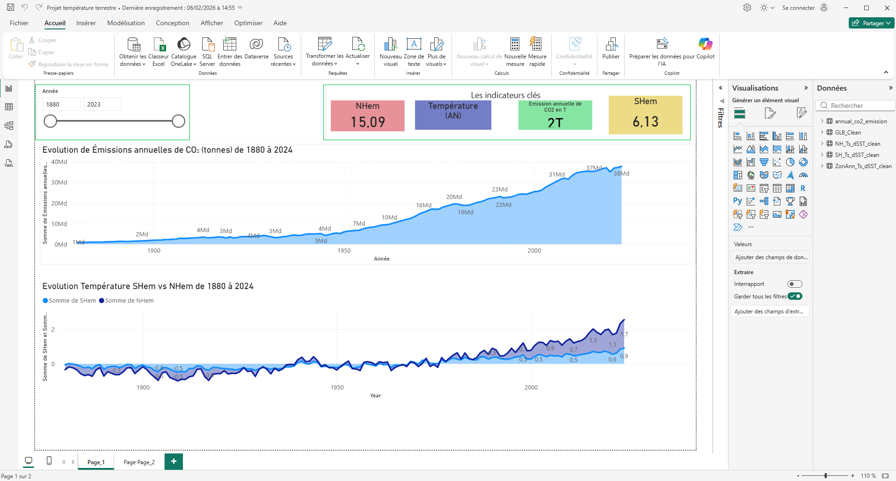

# Analyse de l'évolution des températures terrestres

## Présentation du projet

Ce projet de Data Analysis vise à étudier l'évolution des températures terrestres et des émissions mondiales de CO₂ à travers un tableau de bord interactif réalisé avec Microsoft Power BI.

## Objectifs

- Analyser l'évolution des températures sur une longue période.
- Comparer les anomalies de température entre les hémisphères Nord et Sud.
- Visualiser l'évolution des émissions mondiales de CO₂.
- Construire des indicateurs clés (KPI).
- Faciliter l'exploration des données climatiques à l'aide de filtres interactifs.

## Outils et technologies

- **Power BI Desktop** : conception du tableau de bord.
- **Power Query** : préparation et transformation des données.
- **Data Visualization** : graphiques temporels et indicateurs KPI.

## Tableau de bord Power BI

## Principales analyses

Le tableau de bord permet de visualiser la progression historique des émissions mondiales de CO₂ ainsi que les variations des anomalies de température dans les deux hémisphères.

Les graphiques mettent en évidence les tendances de long terme et permettent des comparaisons selon les périodes sélectionnées.

## Compétences mobilisées

- Préparation et nettoyage de données
- Analyse exploratoire
- Conception de tableaux de bord
- Création d'indicateurs de performance
- Visualisation et interprétation des données

## Fichiers du projet

- `Projet température terrestre.pbix` : rapport Power BI.
- `Dashboard-Temperature.png` : aperçu du tableau de bord.

## Auteur

**Moustapha Gano**

Portfolio Data Analyst — Power BI et analyse de données.
